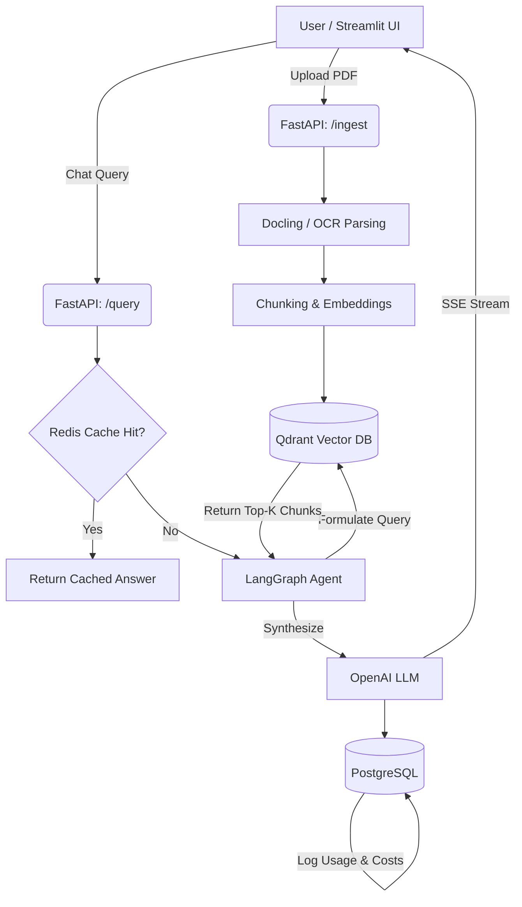

## 🎯 Overview
Research-hub is an advanced, production-grade Retrieval-Augmented Generation (RAG) platform built for research teams, legal professionals, and academics. It solves the massive inefficiency of finding specific data points, methodologies, and figures across disjointed PDF repositories by ingesting complex documents and providing an intelligent, agentic chat interface. Instead of naive keyword search, Research-hub utilizes LangGraph to create an AI reasoning engine that formulates search strategies against a Qdrant vector database. It supports strict multi-tenant isolation, real-time response streaming via Server-Sent Events (SSE), layout-aware document chunking using Docling, and highly optimized Redis semantic caching to drastically reduce LLM API latency and token costs.

## 🛠️ Tech Stack

| Category | Tools/Libraries | Purpose |
|:---:|:---:|:---:|
| **Backend Framework** | FastAPI `0.115.0+` | High-performance async API gateway for routing and dependency injection. |
| **Agentic AI** | LangGraph `0.2.39+`, OpenAI | Orchestrates stateful AI reasoning loops, tool-calling, and response generation. |
| **Vector Database** | Qdrant `1.11.0+` | Stores embeddings and powers extremely fast, multi-tenant semantic searches. |
| **Relational Database** | PostgreSQL, SQLAlchemy | Persists user accounts, team affiliations, and calculates token usage metrics. |
| **Caching Layer** | Redis `5.2.0+` | Two-tier (exact & semantic) caching to bypass expensive LLM calls. |
| **Frontend UI** | Streamlit `1.30.0+` | Rapidly deployed interactive dashboard for chats and document uploads. |
| **Document Processing** | Docling, Tesseract, PyPDF | Extracts multimodal data (tables, text, OCR images) from complex PDFs. |
| **Infrastructure** | Docker, Docker Compose | Containerizes the complex Python and system-level OCR dependencies. |
| **Load Testing** | Locust `2.31.0+` | Simulates multi-tenant real-world traffic patterns for performance testing. |

## 📊 Folder Structure
```text
├── app/                  # (Folder) Core application logic
│   ├── api/              # (Folder) FastAPI routing and endpoint definitions
│   ├── core/             # (Folder) Business logic, AI graphs, caching, security
│   ├── schemas/          # (Folder) Pydantic models for validation
│   └── services/         # (Folder) Data ingestion, LLM clients, Vector DB operations
├── docs/                 # (Folder) Project documentation and architectural plans
├── perf/                 # (Folder) Load testing scripts (Locust, benchmarks)
├── dashboard.py          # (File, ~10KB) Streamlit frontend application
├── main.py               # (File, ~4KB) FastAPI backend entry point and lifespan manager
├── docker-compose.yml    # (File, ~1KB) Orchestrates Postgres, Redis, Qdrant, API, and UI
├── Dockerfile            # (File, ~677B) Multi-stage build for the FastAPI backend
└── requirements.txt      # (File, ~670B) Project dependencies
```
*(Total Files: ~18 root/system files + application source code)*

## 🔍 Architecture & Data Flow


**Flow:** The system heavily utilizes decoupled ingestion and query paths. Data is enriched on ingestion. On query, the system intercepts requests at the Redis layer to save costs. If a cache miss occurs, the stateful LangGraph agent assumes control to retrieve, synthesize, and stream the response backward asynchronously.

## 💻 Key Code Breakdown

### File 1: `main.py`
**Purpose:** The entry point for the FastAPI application, configuring CORS, security middleware, and the application's lifespan.
**Key Logic:**
- Uses `@asynccontextmanager` to initialize PostgreSQL, Redis, Qdrant, and the LangGraph SQLite Checkpointer exactly once before the API accepts traffic.
- Implements `TrustedHostMiddleware` and strict `X-Frame-Options` for production-grade security.

### File 2: `dashboard.py`
**Purpose:** The Streamlit frontend providing the multi-tenant Chat UI and Document Ingestion capabilities.
**Key Logic:**
- **State Management:** Utilizes `st.session_state` to track the JWT `auth_token`, `thread_id`, and chat history.
- **Async Streaming:** Uses `httpx_sse.aconnect_sse` to listen to the backend's Server-Sent Events, updating the Streamlit UI word-by-word without blocking the main thread.

### File 3: `app/api/routes.py`
**Purpose:** Defines the core research API endpoints (`/query`, `/ingest`).
**Key Logic:**
- Implements the `/query` endpoint as an asynchronous generator. It first calls `semantic_cache_get()`. If there is a miss, it triggers `graph.astream_events()` to stream the LangGraph execution steps (tool starts, tokens) back to the client.
- Appends an asynchronous background task `finalize_query_governance()` to log token usage to Postgres after the stream completes.

### File 4: `app/api/auth.py`
**Purpose:** Handles JWT generation and Google SSO integration.
**Key Logic:**
- Extracts the `team_code` from the user and hashes it into a deterministic `tenant_id`.
- Generates a JWT containing the `tenant_id`. This ID is injected into every subsequent request via FastAPI `Depends()`, serving as the backbone for multi-tenant isolation.

### File 5: `app/core/graph.py`
**Purpose:** Orchestrates the AI Agent's reasoning capabilities using LangGraph.
**Key Logic:**
- Defines a `StateGraph` with a "search_vault" tool. 
- The agent loop evaluates the user's query, decides if it needs to search the vector database, extracts context, and compiles the final answer. It attaches to an `AsyncSqliteSaver` to persist memory between stateless HTTP requests.

### File 6: `app/services/vector_store.py`
**Purpose:** Manages connections to Qdrant and handles semantic search logic.
**Key Logic:**
- Exposes `search_vdb(query, tenant_id)`.
- *Crucial pattern:* Always appends a `Filter` containing `FieldCondition(key="tenant_id", match=Value(tenant_id))` to the Qdrant search payload, ensuring users physically cannot retrieve embeddings belonging to other teams.

### File 7: `app/services/ingestion.py`
**Purpose:** Translates raw PDFs into vectorized chunks.
**Key Logic:**
- Integrates `Docling` and `pytesseract` to parse layouts, tables, and images.
- Implements a streaming generator that yields progress updates (`"Extracting text..."`, `"Generating embeddings..."`) back to the frontend to prevent connection timeouts during processing.

### File 8: `app/core/cache.py`
**Purpose:** Implements the two-tier Redis caching system to save API costs.
**Key Logic:**
- **Exact Cache:** A standard key-value lookup of `HASH(tenant_id + query)`.
- **Semantic Cache:** Converts the incoming query to an embedding using local `fastembed` (to avoid OpenAI API costs), and uses Redis Vector Search to find queries with a similarity score > 0.95.

### File 9: `app/core/database.py`
**Purpose:** Manages the relational data layer using SQLAlchemy.
**Key Logic:**
- Defines the `User`, `UsageLog`, and `TraceLog` models. The `UsageLog` table is essential for the governance layer, accurately tracking the input/output tokens and calculating exact USD costs per team.

### File 10: `perf/locustfile.py`
**Purpose:** Simulates heavy real-world traffic patterns for load testing.
**Key Logic:**
- Spawns concurrent users that randomly register, log in, and hit API endpoints.
- Uses `@task(5)` and `@task(1)` frequency weights to accurately model that a user is 5x more likely to hit the `/health` endpoint than the `/debug/stats` endpoint.

## 🚀 Setup & Usage
1. **Clone the Repository & Configure Env**
   ```bash
   git clone https://github.com/your-repo/Research-hub.git
   cd Research-hub
   cp .env.example .env # Add your OPENAI_API_KEY
   ```
2. **Build and Spin up Infrastructure**
   ```bash
   docker compose up --build
   ```
3. **Access the Application**
   - Frontend Dashboard: [http://localhost:8501](http://localhost:8501)
   - API Docs: [http://localhost:8000/docs](http://localhost:8000/docs)

## ❓ Common Questions
- **Q: How does the system achieve Multi-Tenancy safely?** 
  A: It uses Payload Filtering. When a document is ingested, every single vector embedding is tagged with the user's `tenant_id` (derived from their JWT). At query time, the `search_vdb` function hardcodes a Qdrant filter requiring the `tenant_id` to match. Team A physically cannot query Team B's data.
- **Q: How does the app handle long-running PDF ingestion without timing out?** 
  A: Instead of a standard synchronous HTTP request, the `/ingest` endpoint returns a `StreamingResponse` (Server-Sent Events). The `ingestion.py` pipeline yields progress JSON chunks continuously, keeping the HTTP connection alive and updating the Streamlit progress bar.
- **Q: Why use LangGraph instead of standard LangChain RAG?** 
  A: Standard RAG is a linear "retrieve-then-generate" pipeline. LangGraph implements a state machine, allowing the agent to "loop". If the initial search results are poor, the LangGraph agent can realize this and rewrite its query to search again before finally answering the user.
- **Q: How does the Semantic Cache actually save money?** 
  A: In `cache.py`, we use the lightweight, local `fastembed` library to convert the user's question into a vector. We compare this to past questions stored in Redis. If a match is found, we return the cached answer immediately. This entirely bypasses the expensive OpenAI embedding and generation API calls.
- **Q: How is streaming achieved between LangGraph and Streamlit?** 
  A: The FastAPI `/query` endpoint listens to `graph.astream_events()`. Whenever the LLM generates a token, FastAPI yields an SSE event (`data: {"type": "token", "content": "..."}`). Streamlit catches this via `httpx_sse` and updates the UI instantly.
- **Q: Why do you need both PostgreSQL and Qdrant?** 
  A: Qdrant is highly specialized for Vector Math (semantic search). It is terrible at relational mapping. PostgreSQL is used for strict relational schemas like user passwords, team mappings, and precise token-cost tracking for accounting.
- **Q: How do you track the costs of using OpenAI?** 
  A: After the streaming response finishes, FastAPI triggers a `BackgroundTasks`. This task uses the `tiktoken` library to calculate the exact token count of the prompt and response, calculates the USD cost, and inserts a `UsageLog` row into Postgres.
- **Q: What is the purpose of Locust?** 
  A: `perf/locustfile.py` tests how the system handles 50+ concurrent researchers querying the API. It ensures the Postgres connection pools and Redis async clients don't bottleneck under heavy asynchronous load.

## ⚡ Techniques Used
1. **Server-Sent Events (SSE):** [Advanced] Chosen over WebSockets because LLM generation is strictly unidirectional (server pushing text to client). It uses standard HTTP, preventing proxy and firewall issues while achieving real-time UX.
2. **Deterministic Tenant Hashing:** [Intermediate] User `team_codes` are hashed using SHA-256 to generate `tenant_id`s. This ensures PII (like a team name) isn't directly exposed in the Qdrant vector payloads.
3. **Dependency Injection:** [Intermediate] FastAPI's `Depends(get_current_user)` automatically intercepts requests, validates the JWT, and rejects unauthorized traffic before the core route logic ever executes.

## 🌟 Advanced Architecture Highlights
- **Distributed AI Memory:** The LangGraph chat history utilizes an `AsyncPostgresSaver` backed by a high-performance `psycopg` connection pool. This allows the FastAPI backend to scale horizontally across multiple stateless containers, ensuring high availability.
- **Decoupled Background Processing:** Heavy PDF parsing and vectorization workloads are completely decoupled from the HTTP API. The `/ingest` endpoint instantly enqueues tasks to an `arq` (Async Redis Queue) worker pool.
- **Real-Time Pub/Sub Streaming:** To preserve an exceptional user experience during long-running background tasks, the `arq` worker publishes JSON progress events to a Redis channel. The FastAPI server subscribes to this channel and multiplexes the updates back to the Streamlit UI via Server-Sent Events (SSE).

## 📈 Skill Level
**Advanced** - Requires deep knowledge of asynchronous Python (`asyncio`), complex container orchestration, advanced RAG/Agentic AI concepts (LangGraph state machines, vector mathematics), and stream-based networking protocols (SSE).

