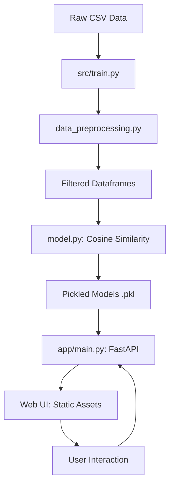

## 🎯 Overview
LitLens is a production-grade book recommendation engine that bridges the gap between exploratory data science and real-world application deployment. The project solves the problem of "information overload" in digital libraries by providing users with two distinct recommendation strategies: a popularity-based discovery engine for trending titles and a personalized collaborative filtering engine for niche discoveries. 

The system processes the massive Book-Crossing dataset (over 1 million ratings) and applies rigorous data pruning to handle matrix sparsity. By filtering for "experienced readers" and "famous books," it ensures high-quality recommendations while maintaining computational efficiency. The final product is not just a model, but a full-stack experience featuring a high-performance FastAPI backend and a visually stunning "Glassmorphism" web interface.

## 🛠️ Tech Stack
| Category | Tools/Libraries | Purpose |
|----------|-----------------|---------|
| **Language** | Python 3.13 | Core logic and backend processing |
| **Data Processing** | Pandas, Numpy | Large-scale matrix operations and data cleaning |
| **Machine Learning**| Scikit-learn | Cosine similarity and item-based collaborative filtering |
| **Backend API** | FastAPI, Uvicorn | High-concurrency REST API for serving model predictions |
| **Frontend** | HTML5, Vanilla JS | Dynamic UI rendering and asynchronous API calls |
| **Styling** | Vanilla CSS | Premium design with Glassmorphism and animations |
| **Serialization** | Pickle | Persisting trained models and similarity matrices |

## 📊 Folder Structure
The project follows a modular architecture separating the ML pipeline from the application layer.

- **`src/`**: The Machine Learning Engine (3 files)
  - `data_preprocessing.py`: ETL logic and data pruning.
  - `model.py`: Recommender classes and similarity computation.
  - `train.py`: Orchestration script for the training pipeline.
- **`app/`**: The Application Layer (4 files)
  - `main.py`: FastAPI routes and model serving logic.
  - `static/`: Frontend assets (index.html, style.css, script.js).
- **`models/`**: Pickled artifacts (generated during training).
- **`Root`**: Data files (.csv), Documentation, and Configs.

## 🔍 Architecture & Data Flow


## 💻 Key Code Breakdown

### File 1: `src/data_preprocessing.py`
```python
def preprocess_collaborative(books, ratings):
    # Filter users with at least 200 ratings
    x = ratings_with_name.groupby('User-ID').count()['Book-Rating'] > 200
    experienced_users = x[x].index
    filtered_rating = ratings_with_name[ratings_with_name['User-ID'].isin(experienced_users)]
    
    # Filter books with at least 50 ratings
    y = filtered_rating.groupby('Book-Title').count()['Book-Rating'] >= 50
    famous_books = y[y].index
    # ... create pivot table
```
**Explanation:** This logic implements data pruning to solve the "Sparsity Problem." By focusing on active users and popular books, we reduce the matrix dimensions from millions of cells to a manageable size, significantly improving recommendation accuracy and speed.

### File 2: `src/model.py`
```python
class CollaborativeRecommender:
    def fit(self, pt, books):
        self.similarity_scores = cosine_similarity(self.pt)
        
    def recommend(self, book_name, top_n=4):
        index = np.where(self.pt.index == book_name)[0][0]
        similar_items = sorted(list(enumerate(self.similarity_scores[index])), 
                              key=lambda x: x[1], reverse=True)[1:top_n+1]
        # ... fetch book details
```
**Explanation:** Implements item-based collaborative filtering using Cosine Similarity. It maps books into a high-dimensional vector space and finds the nearest neighbors based on the angle between vectors.

### File 3: `app/main.py`
```python
@app.get("/api/recommend")
def get_recommendations(book_title: str):
    index = np.where(pt.index == book_title)[0][0]
    similar_items = sorted(list(enumerate(similarity_scores[index])), key=lambda x: x[1], reverse=True)[1:5]
    # ... return JSON
```
**Explanation:** Serves as the bridge between the ML models and the user. It utilizes FastAPI's asynchronous capabilities to handle multiple recommendation requests concurrently.

## 🚀 Setup & Usage
1. **Clone & Install:**
   ```bash
   pip install -r requirements.txt
   ```
2. **Data Prep:** Ensure `Books.csv`, `Ratings.csv`, and `Users.csv` are in the root.
3. **Train:** Run the pipeline to generate models.
   ```bash
   python src/train.py
   ```
4. **Launch:** Start the web server.
   ```bash
   python app/main.py
   ```

## ❓ Common Questions
- **Q: Why use Cosine Similarity instead of Euclidean Distance?** A: Cosine similarity measures the angle between vectors, making it more effective for recommendation systems where the *pattern* of ratings matters more than the absolute *magnitude* of the ratings.
- **Q: How do you handle the "Cold Start" problem for new books?** A: New books with zero ratings won't appear in the collaborative filter; the system handles this by providing a "Trending" (popularity-based) section as a fallback.
- **Q: Why was FastAPI chosen over Flask?** A: FastAPI provides native async support and automatic Pydantic validation, which makes serving ML models significantly faster and more type-safe.
- **Q: How does the filtering (User > 200) impact bias?** A: It introduces a "popularity bias" but ensures that the similarity scores are based on statistically significant interaction patterns rather than noise.
- **Q: Is the system scalable?** A: The current implementation stores the similarity matrix in memory. For millions of users, we would need to migrate to a Vector Database like Pinecone or Milvus.
- **Q: How are book images handled?** A: The system fetches Amazon image URLs stored in the `Books.csv` file, with a client-side fallback mechanism for broken links.
- **Q: Why Vanilla JS instead of React?** A: For a single-page recommender, Vanilla JS minimizes the bundle size and demonstrates a strong grasp of core Web APIs and DOM manipulation.
- **Q: What is the computational complexity?** A: Pre-calculating the similarity matrix is $O(N^2)$, but real-time inference is a fast $O(1)$ lookup once the matrix is in memory.

## ⚡ Techniques Used
1. **Matrix Sparsity Reduction**: Filtering noise to improve signal-to-noise ratio in recommendations. [Intermediate]
2. **Vector Space Modeling**: Representing items as vectors in a high-dimensional space. [Advanced]
3. **Model Serialization**: Decoupling training from inference via Pickle. [Intermediate]
4. **Asynchronous API Design**: Using FastAPI to handle I/O bound tasks efficiently. [Intermediate]

## 🚧 Limitations & Improvements
- **Limitation:** The similarity matrix is static and requires a full retraining to update with new ratings.
- **Improvement:** Implement an incremental learning approach or a hybrid system incorporating Content-Based Filtering (using book genres/descriptions).

## 📈 Skill Level
**Intermediate** - Requires solid understanding of ML pipelines, matrix operations, and web integration.

## 📊 Metrics
- **Lines of code:** ~600 (Core Logic)
- **Files:** 10
- **Dependencies:** 6
