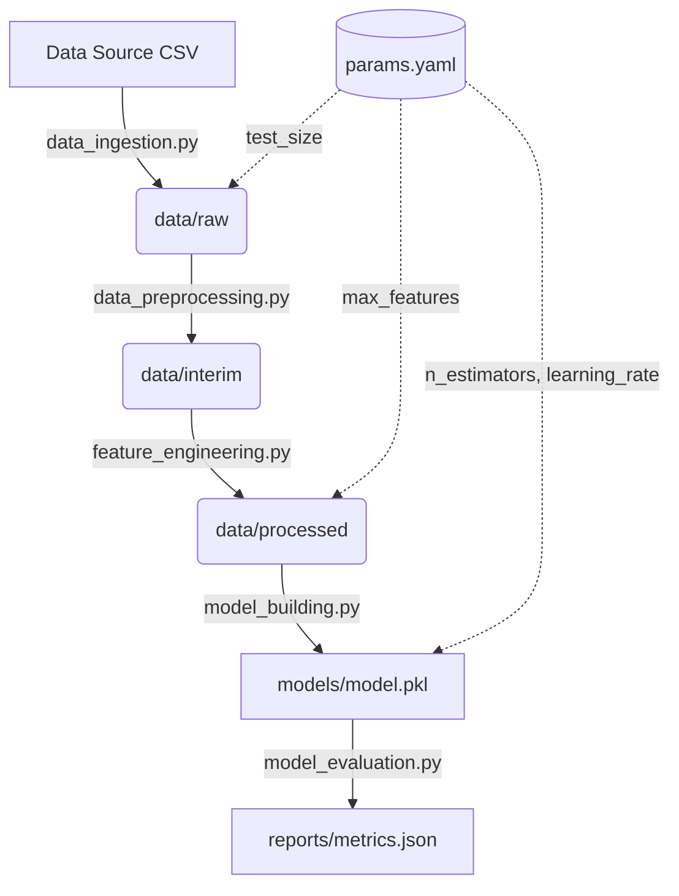

## 🎯 Overview
This project builds a robust, reproducible Machine Learning pipeline for Emotion Detection, classifying text data (tweets) into happiness or sadness sentiments. Rather than relying on a monolithic Jupyter Notebook, the project adopts a production-ready MLOps architecture using Data Version Control (DVC) and the Cookiecutter Data Science structure. 

By decentralizing the machine learning workflow into distinct, testable stages—Data Ingestion, Preprocessing, Feature Engineering, Model Training, and Evaluation—this system ensures absolute reproducibility and maintainability. Experimentation is controlled centrally through a `params.yaml` configuration file, allowing for rapid hyperparameter tuning without modifying the underlying source code. 

The pipeline guarantees that every model artifact is directly traceable to the specific code, data, and parameters used to create it, mitigating the common "it works on my machine" problem in data science. It demonstrates a high standard of ML engineering, ideal for collaborative environments and continuous integration deployment.

## 🛠️ Tech Stack

| Category | Tools/Libraries | Purpose |
|:---:|:---:|:---:|
| **Language** | Python 3.10 | Core programming language |
| **MLOps & Versioning** | DVC 3.65.0, Git | Data and pipeline version control, experiment tracking |
| **Machine Learning** | Scikit-learn 1.7.0 | Gradient Boosting Classifier, TF-IDF Vectorization, Evaluation Metrics |
| **NLP** | NLTK 3.9.2, Regex | Text preprocessing, Lemmatization, Stopword removal |
| **Data Manipulation** | Pandas 2.3.1, NumPy 2.1.2 | Data wrangling and array operations |
| **Configuration** | PyYAML 6.0.2 | Centralized parameter management (`params.yaml`) |

## 📊 Folder Structure
```text
emotion_detection_MLOps_pipeline/
├── data/                  # Data artifacts versioned by DVC
│   ├── raw/               # Unprocessed original data
│   ├── interim/           # Partially processed/cleaned data
│   └── processed/         # Final feature-engineered data ready for training
├── src/                   # Python source code for ML pipeline steps
│   ├── data/              # Ingestion and preprocessing scripts
│   ├── features/          # TF-IDF and feature extraction scripts
│   └── model/             # Training and evaluation scripts
├── models/                # Serialized model artifacts (e.g., model.pkl)
├── reports/               # Generated evaluation metrics (metrics.json)
├── notebooks/             # Exploratory Data Analysis (Jupyter Notebooks)
├── docs/                  # MkDocs project documentation
├── dvc.yaml               # DVC pipeline DAG definition
├── params.yaml            # Hyperparameters and configuration
├── requirements.txt       # Python dependencies (225 packages)
└── Makefile               # Automation commands (setup, lint, format)
```

## 🔍 Architecture & Data Flow


**Explanation:** The DVC pipeline orchestrates a Directed Acyclic Graph (DAG) of operations. Each Python script in `src/` represents a computational node. Scripts read configurable parameters from `params.yaml`, consume inputs from the previous step, and output artifacts for the next step. DVC smartly caches these outputs; if you alter `learning_rate` in `params.yaml`, DVC calculates the dependency tree and only re-runs the Model Building and Evaluation stages.

## 💻 Key Code Breakdown

### File 1: `dvc.yaml`
```yaml
stages:
  model_building:
    cmd: python src/model/model_building.py
    deps:
    - data/processed
    - src/model/model_building.py
    params:
    - model_building.learning_rate
    - model_building.n_estimators
    outs:
    - models/model.pkl
```
**Explanation:** This is the core orchestrator. It defines the `model_building` stage, specifying its exact command, file dependencies (processed data and script), tracked parameters from `params.yaml`, and the expected output artifact. This configuration enables DVC's caching and reproducibility engine.

### File 2: `src/data/data_preprocessing.py`
```python
def normalize_text(df):
    df['content'] = df['content'].apply(lower_case)
    df['content'] = df['content'].apply(remove_stop_words)
    df['content'] = df['content'].apply(removing_numbers)
    df['content'] = df['content'].apply(removing_punctuations)
    df['content'] = df['content'].apply(removing_urls)
    df['content'] = df['content'].apply(lemmatization)
    return df
```
**Explanation:** The centralized NLP preprocessing pipeline. It sequentially applies isolated, unit-testable text cleaning functions to prepare raw tweets for feature extraction. 

### File 3: `src/features/feature_engineering.py`
```python
def apply_bow(train_data: pd.DataFrame, test_data: pd.DataFrame, max_features: int) -> tuple:
    vectorizer = TfidfVectorizer(max_features=max_features)
    X_train_bow = vectorizer.fit_transform(X_train)
    X_test_bow = vectorizer.transform(X_test)
    return train_df, test_df
```
**Explanation:** Converts cleaned text into numerical vectors using TF-IDF. It correctly fits the vectorizer *only* on the training data and transforms the test data, preventing critical data leakage.

### File 4: `src/model/model_building.py`
```python
def train_model(X_train: np.ndarray, y_train: np.ndarray, params: dict) -> GradientBoostingClassifier:
    clf = GradientBoostingClassifier(
        n_estimators=params['n_estimators'], 
        learning_rate=params['learning_rate']
    )
    clf.fit(X_train, y_train)
    return clf
```
**Explanation:** Initializes and trains the Gradient Boosting classification algorithm, dynamically pulling hyperparameters injected from the `params.yaml` dictionary.

### File 5: `src/model/model_evaluation.py`
```python
def evaluate_model(clf, X_test: np.ndarray, y_test: np.ndarray) -> dict:
    y_pred = clf.predict(X_test)
    y_pred_proba = clf.predict_proba(X_test)[:, 1]
    return {
        'accuracy': accuracy_score(y_test, y_pred),
        'precision': precision_score(y_test, y_pred),
        'recall': recall_score(y_test, y_pred),
        'auc': roc_auc_score(y_test, y_pred_proba)
    }
```
**Explanation:** Calculates core classification metrics, tracking both deterministic predictions and probabilities (required for AUC), and formats them for downstream JSON metric tracking by DVC.

## 🚀 Setup & Usage
1. **Clone the repository:**
   ```bash
   git clone https://github.com/yachika-yashu/emotion_detection_MLOps_pipeline.git
   cd emotion_detection_MLOps_pipeline
   ```
2. **Install dependencies:**
   ```bash
   python -m venv venv
   source venv/bin/activate
   pip install -r requirements.txt
   ```
3. **Run the DVC pipeline:**
   ```bash
   dvc pull  # Pulls cached datasets/models if a remote is configured
   dvc repro # Reproduces the entire pipeline based on dvc.yaml
   ```

## ❓ Common Questions
- **Q: Why use DVC instead of keeping everything in a Jupyter Notebook?** 
  A: Notebooks are highly prone to out-of-order execution errors and hidden states. DVC enforces a strict, modular pipeline that guarantees absolute reproducibility from raw data to model metrics.
- **Q: How does the pipeline handle data leakage?** 
  A: In `src/features/feature_engineering.py`, the `TfidfVectorizer` is strictly `fit_transform`ed on the training data, but only `transform`ed on the test data.
- **Q: Where are the model hyperparameters configured?** 
  A: They are centralized in `params.yaml`. Altering a parameter triggers DVC to recognize a state change, allowing targeted re-execution of only the dependent stages.
- **Q: Why use Gradient Boosting for text classification?** 
  A: Gradient Boosting accurately handles complex, non-linear relationships and is highly interpretable. Given the constrained `max_features` via TF-IDF, tree-based ensemble methods can efficiently partition the feature space.
- **Q: How is logging handled across the pipeline?** 
  A: Each module implements the Python `logging` standard library with both a `StreamHandler` for console output and a `FileHandler` for error tracking (e.g., `model_evaluation_errors.log`).
- **Q: What happens if a step in the NLP cleaning fails?** 
  A: The scripts utilize explicit `try/except` blocks that log the specific error to the file handler before re-raising it, halting the pipeline safely and cleanly.
- **Q: How are evaluation metrics tracked and compared?** 
  A: DVC tracks `reports/metrics.json` directly. You can compare different ML experiments natively using the `dvc metrics diff` command.
- **Q: How does the dataset get split?** 
  A: `src/data/data_ingestion.py` uses Scikit-learn's `train_test_split` with a fixed `random_state=42` and a dynamically injected `test_size` from `params.yaml` to ensure consistency.

## ⚡ Techniques Used
1. **DVC Pipeline Orchestration**: Decouples data and code. Code is versioned by Git; Data and Models are versioned by DVC. Facilitates cached partial-execution and massive scalability. [Advanced]
2. **TF-IDF Vectorization**: Transforms variable-length text into fixed-length numeric vectors by evaluating term frequency offset by document frequency. [Intermediate]
3. **Lemmatization (NLTK)**: Reduces words to their base dictionary form (e.g., "running" to "run") to reduce feature sparsity and improve model generalization. [Intermediate]
4. **Gradient Boosting Trees**: An ensemble method that builds sequential decision trees to correct the residual errors of the previously built trees. [Intermediate]

## 📈 Skill Level
**Advanced** - Requires knowledge of MLOps principles, Directed Acyclic Graphs (DAGs), Data Version Control (DVC), Pipeline Orchestration, and modular Software Engineering.

